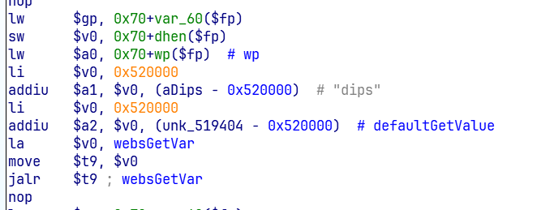
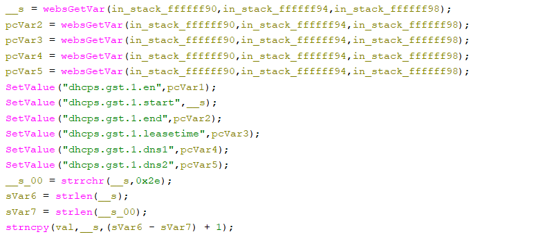

# Tenda AC1206 Vulnerability(Stack Overflow)
This vulnerability lies in the `fromGstDhcpSetSer` CGI handler which affects the latest firmware of Tenda AC1206 (V15.03.06.23).
(The latest version is [V15.03.06.23](https://www.tenda.com.cn/product/help/AC1206))

## Vulnerability Description
There is a **stack-based buffer overflow** vulnerability in function `fromGstDhcpSetSer`, which is reachable via the `fromGstDhcpSetSer` handler registered by `websFormDefine("",(char *)0x0,0,fromGstDhcpSetSer,1);` in `formDefineTendDa`.

In `fromGstDhcpSetSer`, the user-controlled parameters `username` and `password` are retrieved via `websGetVar`,No length validation or sanitization is applied to this input.
- `__s = websGetVar(a1,"dips",*);`

After several statements,there is:
- `strncpy(val,__s,(sVar6 - sVar7) + 1);` with `__s_00 = strrchr(__s,0x2e);`

we can let `__s` be a long strings with no char '.'(0x2e),then strlen(__s_00) == 0,then sVar6-sVar7+1 == strlen(__s). cause buffer overflow.

Reachability:Reachability is plain

## Attack Vector

Send a crafted HTTP request to the `fromGstDhcpSetSer` CGI endpoint with `dips=a*188(or more)`

## Impact

- Denial of Service (crash/reboot)
- Potentially remote code execution

## Timeline

- 2026-3-10: CVE request submitted to MITRE(7568)
- 2026-6-6: Public disclosure - CVE-2026-36789