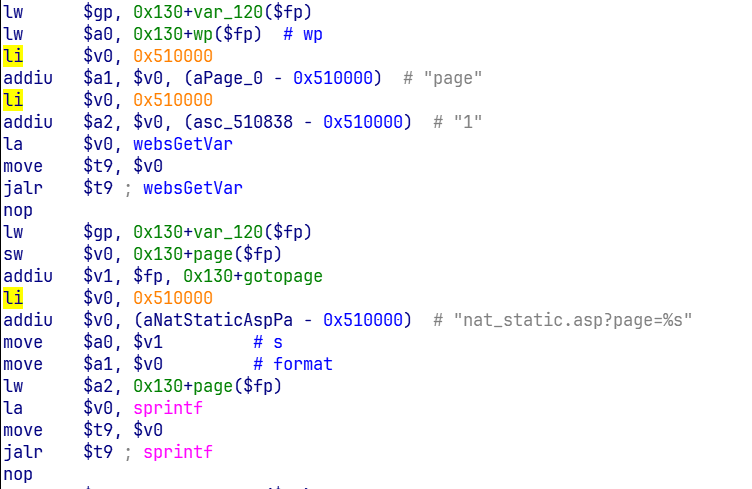
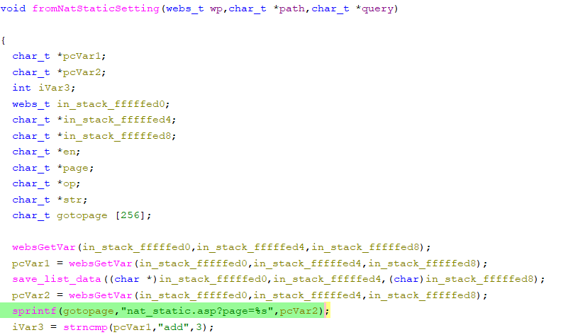

# Tenda AC1206 Vulnerability(Stack Overflow)
This vulnerability lies in the `fromNatStaticSetting` CGI handler which affects the latest firmware of Tenda AC1206 (V15.03.06.23).
(The latest version is [V15.03.06.23](https://www.tenda.com.cn/product/help/AC1206))

## Vulnerability Description
There is a **stack-based buffer overflow** vulnerability in function `fromNatStaticSetting`, which is reachable via the `fromNatStaticSetting` handler registered by `websFormDefine("",(char *)0x0,0,fromNatStaticSetting,1);` in `formDefineTendDa`.

In `fromNatStaticSetting`, the user-controlled parameters `page` are retrieved via `websGetVar`,No length validation or sanitization is applied to this input.
- `pcVar2 = websGetVar(param1,"page",*);`

The next statement is:
- `sprintf(gotopage,"nat_static.asp?page=%s",pcVar2);`

we can let `pcVar2` be a long string, cause buffer overflow.

Reachability:Reachability is plain

## Attack Vector

Send a crafted HTTP request to the `fromNatStaticSetting` CGI endpoint with `page=a*188(or more)`

## Impact

- Denial of Service (crash/reboot)
- Potentially remote code execution

## Timeline

- 2026-3-10: CVE request submitted to MITRE(7572)
- 2026-6-6: Public disclosure - CVE-2026-36790