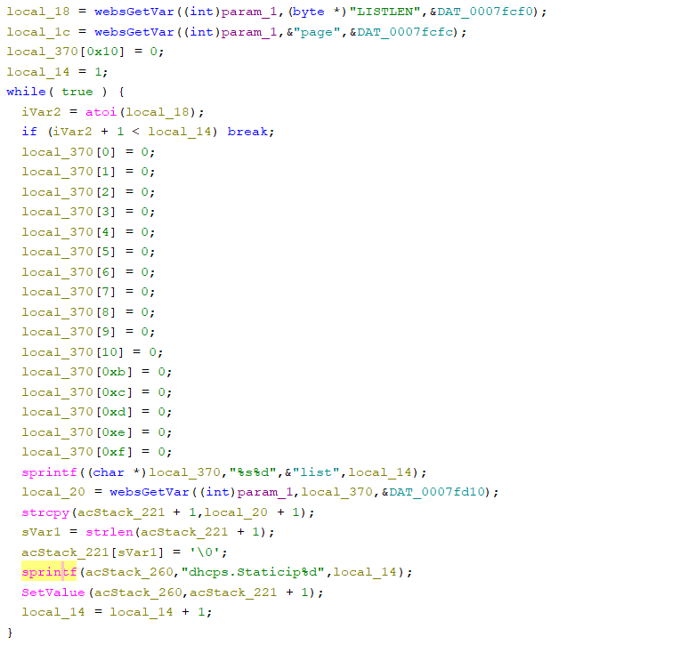

# Tenda fh451 Vulnerability(Stack-Based Buffer Overflow)

This vulnerability lies in the `fromDhcpListClient` CGI handler, which affects Tenda fh451 V1.0.0.9.
(The latest version is [V1.0.0.9](https://www.tenda.com.cn/product/help/FH451))

## Vulnerability Description
There is a **stack-based buffer overflow** vulnerability in function `fromDhcpListClient`, which is reachable via the `fromDhcpListClient` handler registered by `FUN_00014900("DhcpListClient",(int)fromDhcpListClient);` in `FUN_0002db50`.

In `fromDhcpListClient`, A user-influenced HTTP parameters are retrieved through `websGetVar`, including:
- `local_20 = websGetVar((int)param_1,local_370,&DAT_0007fd10);`
- `sprintf((char *)local_370,"%s%d","list",local_14);`

that we can let `LISTLEN=1`,then `local_14=1`,the parameter becomes `list1`

No branch is need,the attacker-influenced `list1` parameter is used in the following command:
- `strcpy(acStack_221 + 1,local_20 + 1);`

Reachability: the vulnerable path is plain.

## Attack Vector
Send a crafted HTTP request to the `fromDhcpListClient` CGI endpoint with long parameter such as `list1 = a*888` and `LISTLEN=1`
## Impact
- Denial of Service (process crash or device instability)

## Timeline
- 2026-3-14: CVE request submitted to MITRE(7425)
- 2026-6-6: Public disclosure - CVE-2026-36786