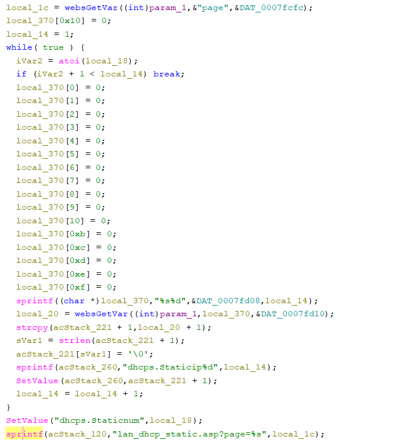

# Tenda fh451 Vulnerability(Stack-Based Buffer Overflow and Arbitrary code execution)

This vulnerability lies in the `fromDhcpListClient` CGI handler, which affects Tenda fh451 V1.0.0.9.
(The latest version is [V1.0.0.9](https://www.tenda.com.cn/product/help/FH451))

## Vulnerability Description
There is a **stack-based buffer overflow** vulnerability in function `fromDhcpListClient`, which is reachable via the `fromDhcpListClient` handler registered by `FUN_00014900("DhcpListClient",(int)fromDhcpListClient);` in `FUN_0002db50`.

In `fromDhcpListClient`, A user-influenced HTTP parameters are retrieved through `websGetVar`, including:
- `local_1c = websGetVar((int)param_1,"page",&DAT_0007fcfc);`

No branch is need,the attacker-influenced `page` parameter is used in the following command:
- `sprintf(acStack_120,"lan_dhcp_static.asp?page=%s",local_1c);`

Reachability: the vulnerable path is plain.

## Attack Vector
Send a crafted HTTP request to the `fromDhcpListClient` CGI endpoint with long parameter such as `page = a*888`
## Impact
- Denial of Service (process crash or device instability)

## Timeline
- 2026-3-14: CVE request submitted to MITRE(5953)The vulnerability is different from that in same function （CVE-2024-46047）