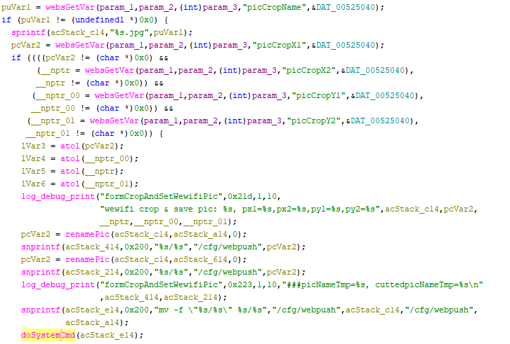

# Tenda G0 Vulnerability(Arbitrary Code Execution)

This vulnerability lies in the `formCropAndSetWewifiPic` function, which affects Tenda G0 V15.11.0.5.
(The latest version is [V15.11.0.5](https://www.tenda.com.cn/download/3022))

## Vulnerability Description
There is a **arbitrary code execution** vulnerability in function `formCropAndSetWewifiPic`.

In `formCropAndSetWewifiPic`, A user-influenced HTTP parameters are retrieved through `websGetVar`, including:
- `puVar1 = websGetVar(param_1,param_2,(int)param_3,"picCropName",&DAT_00525040);`
- `sprintf(longlongh,"%s.jpg",puVar1);`

After some branch,the attacker-influenced `picCropName` parameter is used in the following command:
- `snprintf(acStack_e14,0x200,"mv -f \"%s/%s\" %s/%s","/cfg/webpush",longlongh,"/cfg/webpush",acStack_a14);`
and do systemcmd:
- `doSystemCmd(acStack_e14);`

that will cause arbitrary code execution
Reachability: the vulnerable path is plain (if any parameter from WebsGetVar is not null).

## Attack Vector
Send a crafted HTTP request to the `formCropAndSetWewifiPic` CGI endpoint with long parameter such as `picCropName = a*888`(or more)
## Impact
- Denial of Service (process crash or device instability)
- Arbitrary Code Execution

## Timeline
- 2026-3-17: CVE request submitted to MITRE(8674)