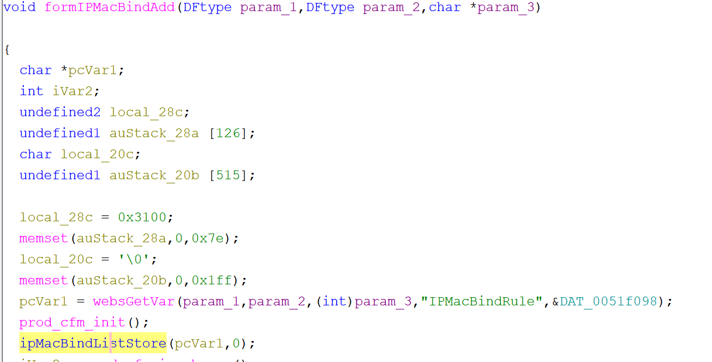
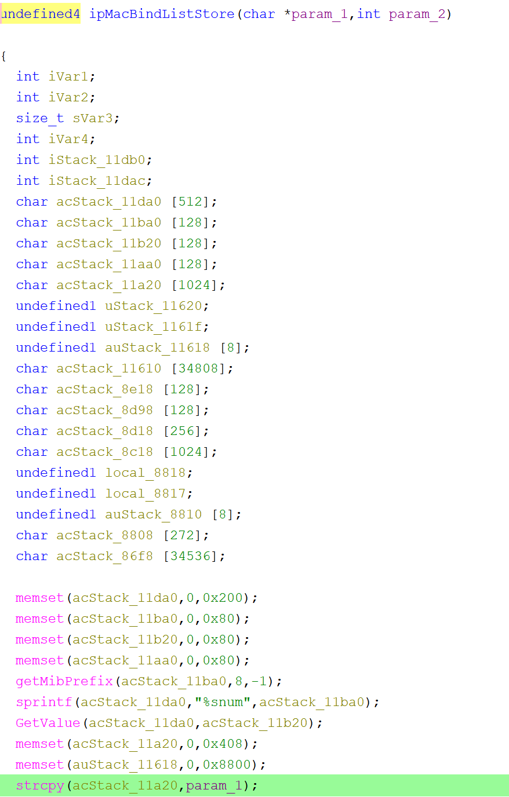

# Tenda G0 Vulnerability(Buffer Overflow)

This vulnerability lies in the `formIPMacBindAdd` function, which affects Tenda G0 V15.11.0.5.
(The latest version is [V15.11.0.5](https://www.tenda.com.cn/download/3022))

## Vulnerability Description
There is a **buffer overflow** vulnerability in function `formIPMacBindAdd`.

In `formIPMacBindAdd`, A user-influenced HTTP parameters are retrieved through `websGetVar`, including:
- `pcVar1 = websGetVar(param_1,param_2,(int)param_3,"IPMacBindRule",&DAT_0051f098);`

In the next,the attacker-influenced `IPMacBindRule` parameter is used in the following command:
- `ipMacBindListStore(pcVar1,0);`

In this function,there is a statement that:
- `strcpy(acStack_11a20,param_1);`

that will cause buffer overflow.

Reachability: the vulnerable path is plain

## Attack Vector
Send a crafted HTTP request to the `formIPMacBindAdd` CGI endpoint with long parameter such as `IPMacBindRule = a*888`(or more)
## Impact
- Denial of Service (process crash or device instability)

## Timeline
- 2026-3-17: CVE request submitted to MITRE(8813)