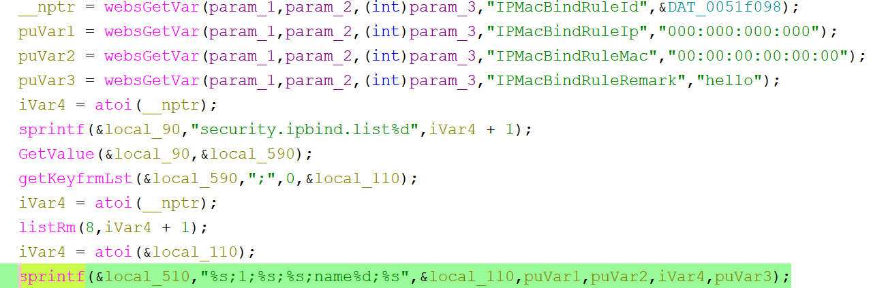

# Tenda G0 Vulnerability(Buffer Overflow)

This vulnerability lies in the `formIPMacBindModify` function, which affects Tenda G0 V15.11.0.5.
(The latest version is [V15.11.0.5](https://www.tenda.com.cn/download/3022))

## Vulnerability Description
There is a **buffer overflow** vulnerability in function `formIPMacBindModify`.

In `formIPMacBindModify`, A user-influenced HTTP parameters are retrieved through `websGetVar`, including:
- `puVar1 = websGetVar(param_1,param_2,(int)param_3,"IPMacBindRuleIp","000:000:000:000");` 
- `puVar2 = websGetVar(param_1,param_2,(int)param_3,"IPMacBindRuleMac","00:00:00:00:00:00");`

In the next,the attacker-influenced `IPMacBindRuleIp` or `IPMacBindRuleMac` parameter is used in the following command:
- `sprintf(&local_510,"%s;1;%s;%s;name%d;%s",&local_110,puVar1,puVar2,iVar4,puVar3);`

that will cause buffer overflow.

Reachability: the vulnerable path is plain

## Attack Vector
Send a crafted HTTP request to the `formIPMacBindModify` CGI endpoint with long parameter such as `IPMacBindRuleIp(IPMacBindRuleMac) = a*888`(or more)
## Impact
- Denial of Service (process crash or device instability)

## Timeline
- 2026-3-17: CVE request submitted to MITRE(8680)