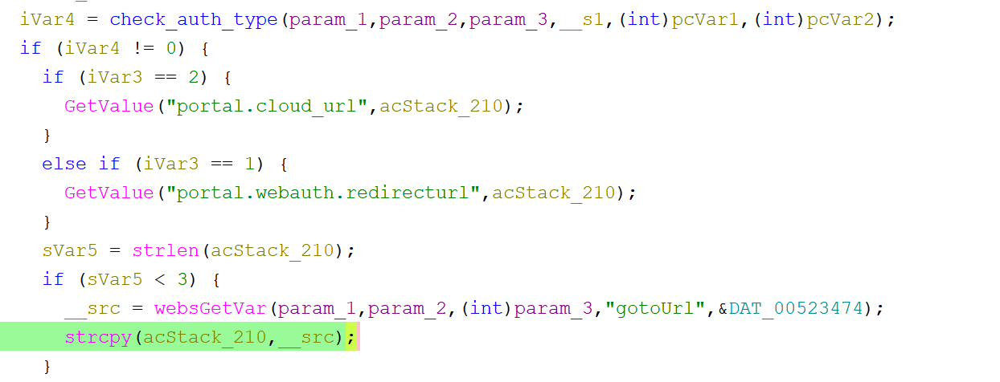

# Tenda G0 Vulnerability(Buffer Overflow)

This vulnerability lies in the `formPortalAuth` function, which affects Tenda G0 V15.11.0.5.
(The latest version is [V15.11.0.5](https://www.tenda.com.cn/download/3022))

## Vulnerability Description
There is a **buffer overflow** vulnerability in function `formPortalAuth`,via registered by handler `websDefineAction(param_1,param_2,"portalAuth",(int)formPortalAuth);`.

In `formPortalAuth`, A user-influenced HTTP parameters are retrieved through `gotoUrl`, including:
- `__src = websGetVar(param_1,param_2,(int)param_3,"gotoUrl",&DAT_00523474);` 

In the next,the attacker-influenced `gotoUrl` parameter is used in the following command:
- `strcpy(acStack_210,__src);`

that will cause buffer overflow.

Reachability: the vulnerable path is plain

## Attack Vector
Send a crafted HTTP request to the `formPortalAuth` CGI endpoint with long parameter such as `gotoUrl = a*888`(or more)

## Impact
- Denial of Service (process crash or device instability)

## Timeline
- 2026-3-17: CVE request submitted to MITRE(8705)
- 2026-6-6: Public disclosure - CVE-2026-36799