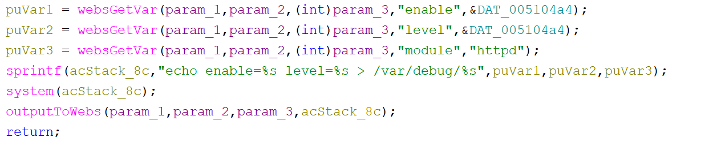

# Tenda G0 Vulnerability(Arbitrary Code Execution)

This vulnerability lies in the `formPortalAuth` function, which affects Tenda G0 V15.11.0.5.
(The latest version is [V15.11.0.5](https://www.tenda.com.cn/download/3022))

## Vulnerability Description
There is a **arbitrary code execution** vulnerability in function `formPortalAuth`,via registered by handler `websDefineAction(param_1,param_2,"portalAuth",(int)formPortalAuth);`.

In `formPortalAuth`, A user-influenced HTTP parameters are retrieved through `websGetVar`, including:
- `__src = websGetVar(param_1,param_2,(int)param_3,"gotoUrl",&DAT_00523474);`

After some branch,the attacker-influenced `enable,level,module` parameter is used in the following command:
- `sprintf(acStack_8c,"echo enable=%s level=%s > /var/debug/%s",puVar1,puVar2,puVar3);`
and do systemcmd:
- `system(acStack_8c);`

that will cause arbitrary code execution
Reachability: the vulnerable path is plain

## Attack Vector
Send a crafted HTTP request to the `formPortalAuth` CGI endpoint with long parameter such as `enable/level/module = 1;telnet 127.0.0.1 80;`or`enable/level/module = a*888`
## Impact
- Denial of Service (process crash or device instability)
- Arbitrary Code Execution

## Timeline
- 2026-3-17: CVE request submitted to MITRE(8682)
- 2026-6-6: Public disclosure - CVE-2026-36798