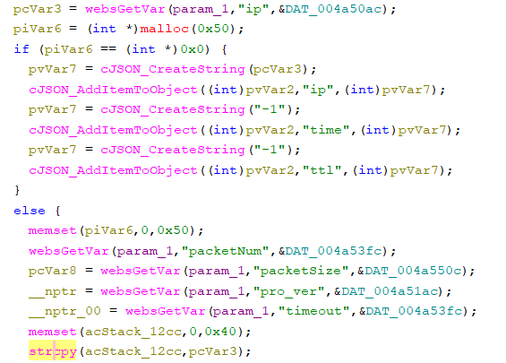

# Tenda O3 Vulnerability(Stack-Based Buffer Overflow)

This vulnerability lies in the `fromNetToolGet` CGI handler, which affects Tenda O3v3.
(The latest version is [V1.0.0.5](https://www.tenda.com.cn/product/download/O3v3.html))

## Vulnerability Description
There is a **stack-based buffer overflow** vulnerability in function `fromNetToolGet`, which is reachable via the `fromNetToolGet` handler registered by `websFormDefine("setPingInfo",(int)fromNetToolGet);` in `formDefineTendDa`.

In `fromNetToolGet`, A user-influenced HTTP parameters are retrieved through `websGetVar`, including:
- `pcVar3 = websGetVar(param_1,"ip",&DAT_004a50ac);`

When the request satisfies the branch condition, the attacker-influenced `ip` parameter is used in the following command:
- `strcpy(acStack_12cc,pcVar3);`

Reachability: the vulnerable path is entered when `malloc` returns a normal pointer,which is easy to be.

## Attack Vector
Send a crafted HTTP request to the `fromNetToolGet` CGI endpoint with `ip=aaaaaa*88..`
## Impact

- Denial of Service (process crash or device instability)

## Timeline
- 2026-3-13: CVE request submitted to MITRE(6786)
- 2026-6-6: Public disclosure - CVE-2026-36784
