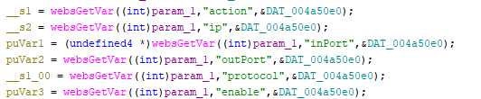
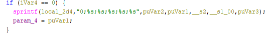

# Tenda O3 Vulnerability(Stack Overflow)
This vulnerability lies in the `fromVirtualSer` CGI handler which affects the latest firmware of Tenda O3.
(The latest version is [V1.0.0.5](https://www.tenda.com.cn/product/download/O3v3.html))

## Vulnerability Description
There is a **stack-based buffer overflow** vulnerability in function `fromVirtualSer`, which is reachable via the `fromVirtualSer` handler registered by `websFormDefine((int *)"setPortList",(int)fromVirtualSer);` in `formDefineTendDa`.

In `fromVirtualSer`, the user-controlled parameters `puVar2`,`puVar1`,`__s2`,`__s1_00`,`puVar3` are retrieved via `websGetVar`,No length validation or sanitization is applied to this input.
- `__s2 = websGetVar((int)param_1,"ip",&DAT_004a50e0);`
- `puVar1 = (undefined4 *)websGetVar((int)param_1,"inPort",&DAT_004a50e0);`
- `puVar2 = websGetVar((int)param_1,"outPort",&DAT_004a50e0);`
- `__s1_00 = websGetVar((int)param_1,"protocol",&DAT_004a50e0);`
- `puVar3 = websGetVar((int)param_1,"enable",&DAT_004a50e0);`

After several authentication checks and control-flow branches, these vars reaches the following statement:
- `sprintf(local_2d4,"0;%s;%s;%s;%s;%s",puVar2,puVar1,__s2,__s1_00,puVar3);`

Because sprintf performs an unbounded copy until a null terminator is encountered, supplying a sufficiently long username value will overwrite adjacent stack memory.

Reachability:Both parameters are therefore fully controlled by the HTTP request.Execution proceeds if `GetValue("wans.flag",local_10);iVar4 = strcmp(local_10,"1"); if (iVar4 == 0)` which is easy to set.

## Attack Vector

Send a crafted HTTP request to the `fromVirtualSer` CGI endpoint with overly long `puVar2`,`puVar1`,`__s2`,`__s1_00`,`puVar3`(any one) parameters.

## Impact

- Denial of Service (crash/reboot)
- Potentially arbitrary code execution

## Timeline

- 2026-3-10: CVE request submitted to MITRE
