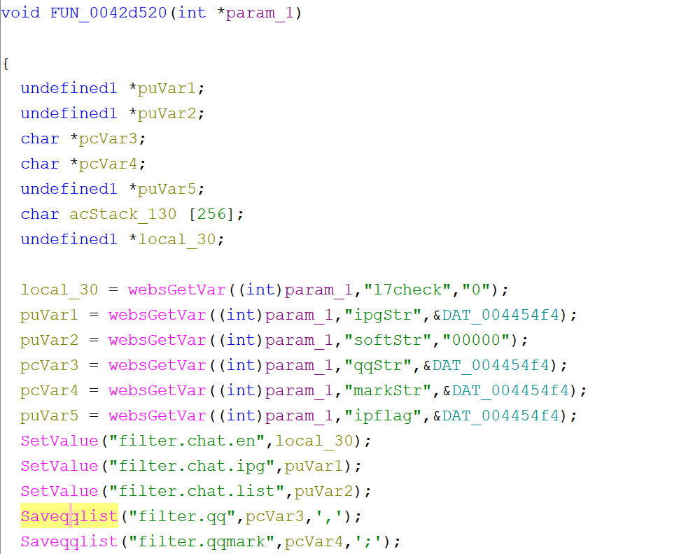
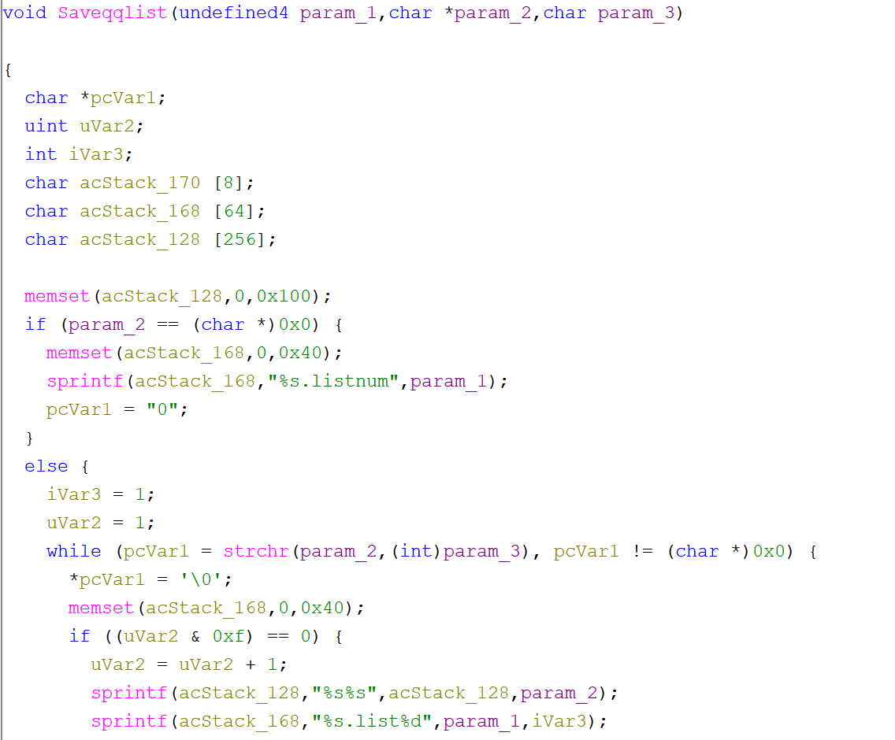

# Tenda PW201A Vulnerability(buffer overflow)

This vulnerability lies in the `0x42d520` function, which affects Tenda PW201A V1.0.5 in file TENDA_HTTPD
(The latest version is [V1.0.5](https://www.tenda.com.cn/download/detail-1856.html))

## Vulnerability Description
There is a **buffer overflow** vulnerability in function `0x42d520`,via registed by handler `websFormDefine("L7Im",0x42d520);`
In `0x42d520`, A user-influenced HTTP parameters are retrieved through `websGetVar`, including:
- `pcVar3 = websGetVar((int)param_1,"qqStr",&DAT_004454f4);`
- `pcVar4 = websGetVar((int)param_1,"markStr",&DAT_004454f4);`
     
In the next,the attacker-influenced `qqStr(markStr)` parameter is used in the following command:
- `Saveqqlist("filter.qq",pcVar3,',');`
- `Saveqqlist("filter.qqmark",pcVar4,';');`

In this function,there is a statement that:
- `sprintf(acStack_128,"%s%s",acStack_128,param_2);`

Reachability: the vulnerable path is plain,if `strchr(param_2,(int)param_3)!=0`

## Attack Vector
Send a crafted HTTP request to the `0x42d520` CGI endpoint with long parameter such as `qqStr(or markStr) = 'a,'*888`(or more)
## Impact
- Denial of Service (process crash or device instability)

## Timeline
- 2026-3-17: CVE request submitted to MITRE(8928)
- 2026-6-6: Public disclosure - CVE-2026-36805