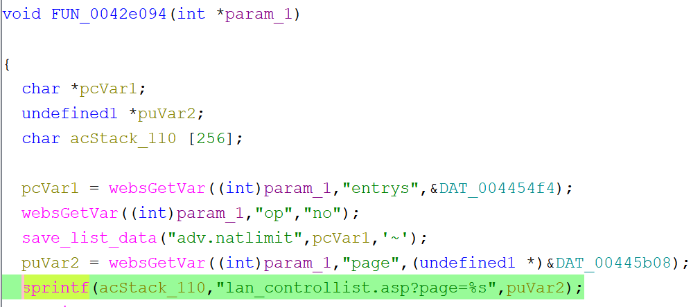

# Tenda PW201A Vulnerability(buffer overflow)

This vulnerability lies in the `0x42e094` function, which affects Tenda PW201A V1.0.5 in file TENDA_HTTPD
(The latest version is [V1.0.5](https://www.tenda.com.cn/download/detail-1856.html))

## Vulnerability Description
There is a **buffer overflow** vulnerability in function `0x42e094`,via registed by handler `websFormDefine("Natlimit",0x42e094);`
In `0x42e094`, A user-influenced HTTP parameters are retrieved through `websGetVar`, including:
- `puVar2 = websGetVar((int)param_1,"page",(undefined1 *)&DAT_00445b08);`
     
In the next,the attacker-influenced `page` parameter is used in the following command:
- `sprintf(acStack_110,"lan_controllist.asp?page=%s",puVar2);`

that will cause buffer overflow.

Reachability: the vulnerable path is plain

## Attack Vector
Send a crafted HTTP request to the `0x42e094` CGI endpoint with long parameter such as `page = a*888`(or more)
## Impact
- Denial of Service (process crash or device instability)

## Timeline
- 2026-3-17: CVE request submitted to MITRE(8860)
- 2026-6-6: Public disclosure - CVE-2026-36803