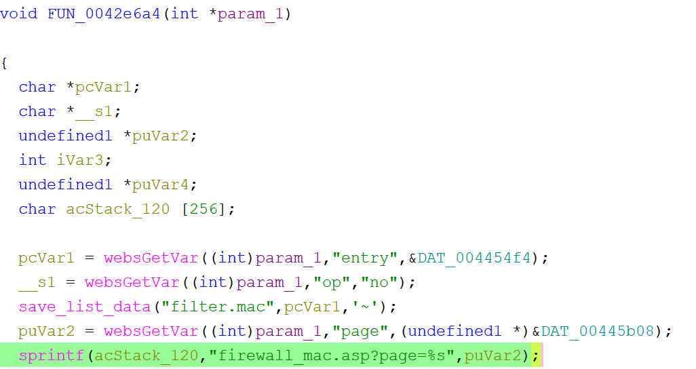

# Tenda PW201A Vulnerability(buffer overflow)

This vulnerability lies in the `0x42e6a4` function, which affects Tenda PW201A V1.0.5 in file TENDA_HTTPD
(The latest version is [V1.0.5](https://www.tenda.com.cn/download/detail-1856.html))

## Vulnerability Description
There is a **buffer overflow** vulnerability in function `0x42e6a4`,via registed by handler `websFormDefine("SafeMacFilter",0x42e6a4);`

In `0x42e6a4`, A user-influenced HTTP parameters are retrieved through `websGetVar`, including:
- `puVar2 = websGetVar((int)param_1,"page",(undefined1 *)&DAT_00445b08);`
     
In the next,the attacker-influenced `page` parameter is used in the following command:
- `sprintf(acStack_120,"firewall_mac.asp?page=%s",puVar2);`

that will cause buffer overflow.

Reachability: the vulnerable path is plain

## Attack Vector
Send a crafted HTTP request to the `0x42e6a4` CGI endpoint with long parameter such as `page = a*888`(or more)
## Impact
- Denial of Service (process crash or device instability)

## Timeline
- 2026-3-17: CVE request submitted to MITRE(8831)