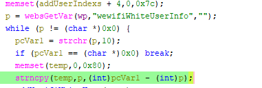

# Tenda W15E Vulnerability(Buffer Overflow)

This vulnerability lies in the `formAddWewifiWhiteUser` function, which affects Tenda W15E V15.11.0.10.
(The latest version is [V15.11.0.10](https://www.tendacn.com/product/help/W15EV2))

## Vulnerability Description
There is a **buffer overflow** vulnerability in function `formAddWewifiWhiteUser` via registered by handler `websDefineAction("addWewifiWhiteUser",formAddWewifiWhiteUser);`

In `formAddWewifiWhiteUser`, A user-influenced HTTP parameters are retrieved through `websGetVar`, including:
- `p = websGetVar(wp,"wewifiWhiteUserInfo","");`

In the next,the attacker-influenced `wewifiWhiteUserInfo` parameter is used in the following command:
- `pcVar1 = strchr(p,'\n')`
- `strncpy(temp,p,(int)pcVar1 - (int)p);`
that will cause buffer overflow,when we let `p` be `a*500+'\n'`,so `pcVar1 - p = 500`(or more)  

Reachability: the vulnerable path is plain.

## Attack Vector
Send a crafted HTTP request to the `formAddWewifiWhiteUser` CGI endpoint with long parameter such as `wewifiWhiteUserInfo = a*888 + '\n'*50`(or more)
## Impact
- Denial of Service (process crash or device instability)

## Timeline
- 2026-3-18: CVE request submitted to MITRE(9488)