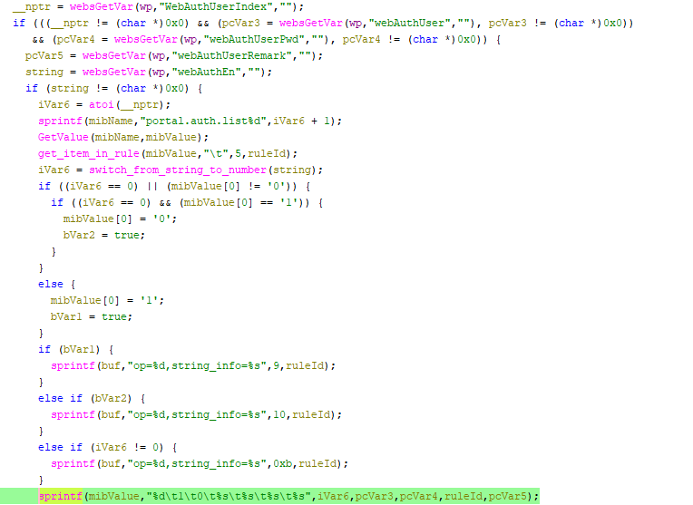

# Tenda W15E Vulnerability(Buffer Overflow)

This vulnerability lies in the `formModifyWebAuthUser` function, which affects Tenda W15E V15.11.0.10.
(The latest version is [V15.11.0.10](https://www.tendacn.com/product/help/W15EV2))

## Vulnerability Description
There is a **buffer overflow** vulnerability in function `formModifyWebAuthUser` via registered by handler `websDefineAction("modifyWebAuthUser",formModifyWebAuthUser);`

In `formModifyWebAuthUser`, A user-influenced HTTP parameters are retrieved through `websGetVar`, including:
- `pcVar3 = websGetVar(wp,"webAuthUser","")`
- `pcVar4 = websGetVar(wp,"webAuthUserPwd","")`

In the next,the attacker-influenced `webAuthUser,webAuthUserPwd` parameter is used in the following command:
- `sprintf(mibValue,"%d\t1\t0\t%s\t%s\t%s\t%s",iVar6,pcVar3,pcVar4,ruleId,pcVar5);`
that will cause buffer overflow.

Reachability: the vulnerable path is plain,if parameters `WebAuthUserIndex,webAuthUser,webAuthUserPwd` are not null.

## Attack Vector
Send a crafted HTTP request to the `formModifyWebAuthUser` CGI endpoint with long parameter such as `WebAuthUserIndex = 1; webAuthUser,webAuthUserPwd = a*888`(or more)
## Impact
- Denial of Service (process crash or device instability)

## Timeline
- 2026-3-18: CVE request submitted to MITRE(9460)
- 2026-6-6: Public disclosure - CVE-2026-36806