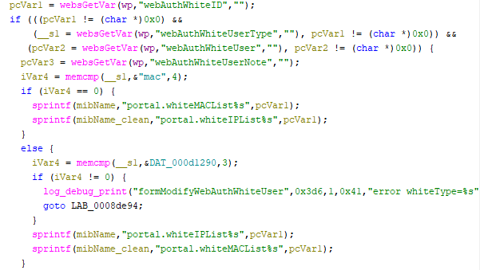

# Tenda W15E Vulnerability(Buffer Overflow)

This vulnerability lies in the `formModifyWebAuthWhiteUser` function, which affects Tenda W15E V15.11.0.10.
(The latest version is [V15.11.0.10](https://www.tendacn.com/product/help/W15EV2))

## Vulnerability Description
There is a **buffer overflow** vulnerability in function `formModifyWebAuthWhiteUser` via registered by handler `websDefineAction("modifyWebAuthWhiteUser",formModifyWebAuthWhiteUser);`

In `formModifyWebAuthWhiteUser`, A user-influenced HTTP parameters are retrieved through `websGetVar`, including:
- `pcVar1 = websGetVar(wp,"webAuthWhiteID","");`

In the next,the attacker-influenced `webAuthWhiteID` parameter is used in the following command:
- `printf(mibName,"portal.whiteMACList%s",pcVar1);`
- `sprintf(mibName_clean,"portal.whiteIPList%s",pcVar1);`
that will cause buffer overflow.

Reachability: the vulnerable path is plain,if parameters `webAuthWhiteUserType,webAuthWhiteUser,webAuthUserPwd` are not null，and `webAuthWhiteUserType=="mac"`

## Attack Vector
Send a crafted HTTP request to the `formModifyWebAuthWhiteUser` CGI endpoint with long parameter such as `webAuthWhiteUserType=="mac"; webAuthWhiteUser,webAuthUserPwd = a; webAuthWhiteID=888*a`(or more)
## Impact
- Denial of Service (process crash or device instability)

## Timeline
- 2026-3-18: CVE request submitted to MITRE(9471)
- 2026-6-6: Public disclosure - CVE-2026-36809