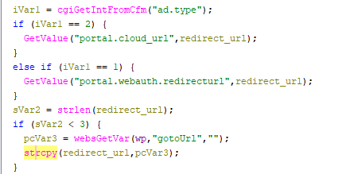

# Tenda W15E Vulnerability(Buffer Overflow)

This vulnerability lies in the `formPortalAuth` function, which affects Tenda W15E V15.11.0.10.
(The latest version is [V15.11.0.10](https://www.tendacn.com/product/help/W15EV2))

## Vulnerability Description
There is a **buffer overflow** vulnerability in function `formPortalAuth`,via registered by handler `websDefineAction(param_1,param_2,"portalAuth",(int)formPortalAuth);`.

In `formPortalAuth`, A user-influenced HTTP parameters are retrieved through `WebsGetVar`, including:
- `pcVar3 = websGetVar(wp,"gotoUrl","");` 

In the next,the attacker-influenced `gotoUrl` parameter is used in the following command:
- `strcpy(redirect_url,pcVar3);`

that will cause buffer overflow.

Reachability: the vulnerable path is plain

## Attack Vector
Send a crafted HTTP request to the `formPortalAuth` CGI endpoint with long parameter such as `gotoUrl = a*888`(or more)

## Impact
- Denial of Service (process crash or device instability)

## Timeline
- 2026-3-18: CVE request submitted to MITRE(9474)
- 2026-6-6: Public disclosure - CVE-2026-36810