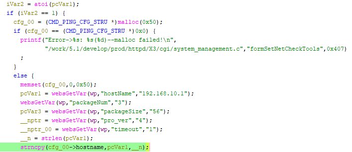

# Tenda W15E Vulnerability(Buffer Overflow)

This vulnerability lies in the `formSetNetCheckTools` function, which affects Tenda W15E V15.11.0.10.
(The latest version is [V15.11.0.10](https://www.tendacn.com/product/help/W15EV2))

## Vulnerability Description
There is a **buffer overflow** vulnerability in function `formSetNetCheckTools`,via registered by handler `websDefineAction("setFixTools",formSetNetCheckTools);`.

In `formSetNetCheckTools`, A user-influenced HTTP parameters are retrieved through `WebsGetVar`, including:
- `pcVar1 = websGetVar(wp,"hostName","192.168.10.1");` 

In the next,the attacker-influenced `hostname` parameter is used in the following command:
- `__n = strlen(pcVar1);`
- `strncpy(cfg_00->hostname,pcVar1,__n);`

that will cause buffer overflow.

Reachability: the vulnerable path is plain

## Attack Vector
Send a crafted HTTP request to the `formSetNetCheckTools` CGI endpoint with long parameter such as `hostname = a*888`(or more)

## Impact
- Denial of Service (process crash or device instability)

## Timeline
- 2026-3-18: CVE request submitted to MITRE(9486)