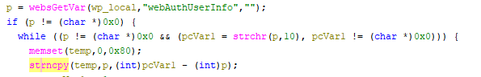

# Tenda W15E Vulnerability(Buffer Overflow)

This vulnerability lies in the `formAddWebAuthUser` function, which affects Tenda W20E V15.11.0.6.
(The latest version is [V16.01.0.6](https://www.tendacn.com/product/help/W20E))

## Vulnerability Description
There is a **buffer overflow** vulnerability in function `formAddWebAuthUser` via registered by handler `websDefineAction("addWebAuthUser",formAddWebAuthUser);`

In `formAddWebAuthUser`, A user-influenced HTTP parameters are retrieved through `websGetVar`, including:
- `p = websGetVar(wp_local,"webAuthUserInfo","");`

In the next,the attacker-influenced `webAuthUserInfo` parameter is used in the following command:
- `pcVar1 = strchr(p,'\n')`
- `strncpy(temp,p,(int)pcVar1 - (int)p);`
that will cause buffer overflow,when we let `p` be `a*500+'\n'`,so `pcVar1 - p = 500`(or more)  

Reachability: the vulnerable path is plain。

## Attack Vector
Send a crafted HTTP request to the `formAddWebAuthUser` CGI endpoint with long parameter such as `webAuthUserInfo = a*888 + '\n'*50`(or more)
## Impact
- Denial of Service (process crash or device instability)

## Timeline
- 2026-3-19: CVE request submitted to MITRE(10344)