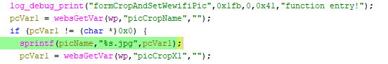

# Tenda W15E Vulnerability(Buffer Overflow)

This vulnerability lies in the `formCropAndSetWewifiPic` function, which affects Tenda W20E V15.11.0.6.
(The latest version is [V16.01.0.6](https://www.tendacn.com/product/help/W20E))

## Vulnerability Description
There is a **buffer overflow** vulnerability in function `formCropAndSetWewifiPic`.

In `formCropAndSetWewifiPic`, A user-influenced HTTP parameters are retrieved through `WebsGetVar`, including:
- `pcVar1 = websGetVar(wp,"picCropName","");` 

In the next,the attacker-influenced `picCropName` parameter is used in the following command:
- `sprintf(picName,"%s.jpg",pcVar1);`

that will cause buffer overflow.

Reachability: the vulnerable path is plain.

## Attack Vector
Send a crafted HTTP request to the `formCropAndSetWewifiPic` CGI endpoint with long parameter such as `picCropName = a*888`(or more)

## Impact
- Denial of Service (process crash or device instability)

## Timeline
- 2026-3-19: CVE request submitted to MITRE(10344)