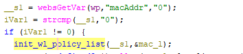
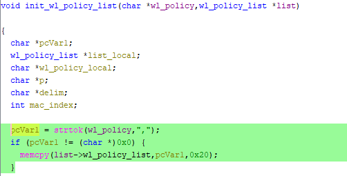

# Tenda W15E Vulnerability(Buffer Overflow)

This vulnerability lies in the `formDelStaState` function, which affects Tenda W20E V15.11.0.6.
(The latest version is [V16.01.0.6](https://www.tendacn.com/product/help/W20E))

## Vulnerability Description
There is a **buffer overflow** vulnerability in function `formDelStaState` via registered by handler `websDefineAction("delStaState",formDelStaState);`

In `formDelStaState`, A user-influenced HTTP parameters are retrieved through `websGetVar`, including:
- `__s1 = websGetVar(wp,"macAddr","0");`

In the next,the attacker-influenced `macAddr` parameter is used in the following command:
- `init_wl_policy_list(__s1,&mac_l);` if `strcmp(__s1,"0") != 0` 

In this function,there is a statement that:
- `pcVar1 = strtok(wl_policy,",");`
- `memcpy(list->wl_policy_list,pcVar1,0x20);`

that will cause buffer overflow,when we let `macAddr` be `a*500+','`,so `pcVar1 = 500*a`(or more)  

Reachability: the vulnerable path is plain.

## Attack Vector
Send a crafted HTTP request to the `formDelStaState` CGI endpoint with long parameter such as `macAddr = a*888 + ','`(or more)
## Impact
- Denial of Service (process crash or device instability)

## Timeline
- 2026-3-19: CVE request submitted to MITRE(10344)