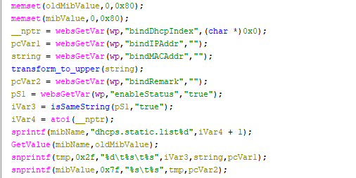

# Tenda W15E Vulnerability(Buffer Overflow)

This vulnerability lies in the `fromSetDhcpRules` function, which affects Tenda W20E V15.11.0.6.
(The latest version is [V16.01.0.6](https://www.tendacn.com/product/help/W20E))

## Vulnerability Description
There is a **buffer overflow** vulnerability in function `fromSetDhcpRules` via registered by handler `websDefineAction("setDhcpRules",fromSetDhcpRules);`

In `fromSetDhcpRules`, there is a function call `modifyDhcpRule(wp);`

In this function,a user-influenced HTTP parameters are retrieved through `websGetVar`, including:
- `string = websGetVar(wp,"bindMACAddr","");`

the attacker-influenced `bindMACAddr` parameter is used in the following command:
- `snprintf(tmp,0x2f,"%d\t%s\t%s",iVar3,string,pcVar1);` 

that will cause buffer overflow,(when we let `bindMACAddr` be `a*888`).

Reachability: the vulnerable path is plain.

## Attack Vector
Send a crafted HTTP request to the `fromSetDhcpRules` CGI endpoint with long parameter such as `bindMACAddr = a*888`(or more)
## Impact
- Denial of Service (process crash or device instability)

## Timeline
- 2026-3-19: CVE request submitted to MITRE(10344)
- 2026-6-6: Public disclosure - CVE-2026-36819