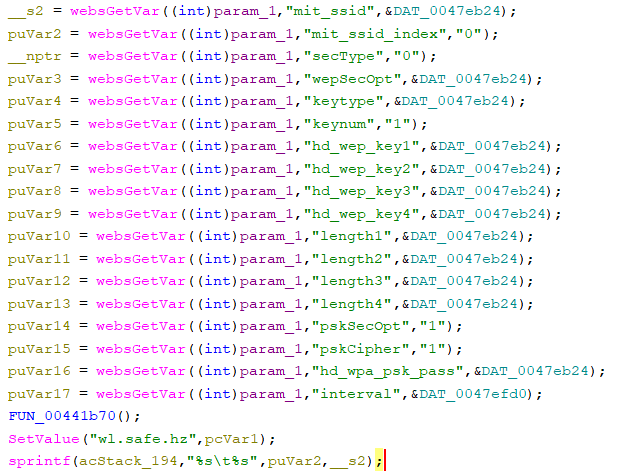

# Tenda W3V1.0BR_V1.0.0.3(2204) Vulnerability (Stack Overflow)
This vulnerability lies in the `FUN_00442b44` CGI handler which affects the latest firmware of Tenda W3 Wireless Router V1.0.
(The latest version is [V1.0.0.3(2204)](https://www.tenda.com.cn/material/show/2484))

## Vulnerability Description

A **stack-based buffer overflow vulnerability** exists in the `FUN_00442b44` function，which is reachable via the `formwrlSSIDset` handler registered by `websAspDefine((int *)"MakeAccessMethodList",FUN_00442b44);` in function `FUN_00423160`.
In `FUN_00442b44`, the user-controlled HTTP parameter `mit_ssid` and `mis_ssid_index` is retrieved via `websGetVar`:

- `__s2 = websGetVar((int)param_1,"mit_ssid",&DAT_0047eb24);`
- `puVar2 = websGetVar((int)param_1,"mit_ssid_index","0");`

Later, there is a function call that:

- `sprintf(acStack_194,"%s\t%s",puVar2,__s2);`

Because sprintf performs no bounds checking, an attacker can supply an overly long GO value to overflow the stack buffer, potentially causing a crash/reboot and Denial of Service.

## Attack Vector

A crafted HTTP request to `FUN_00442b44` CGI handler with an excessively long `mit_ssid` and `mis_ssid_index` parameter.

## Impact

- Denial of Service (httpd crash / device reboot)

## Timeline

- 2026-3-15: CVE request submitted to MITRE(0716)

