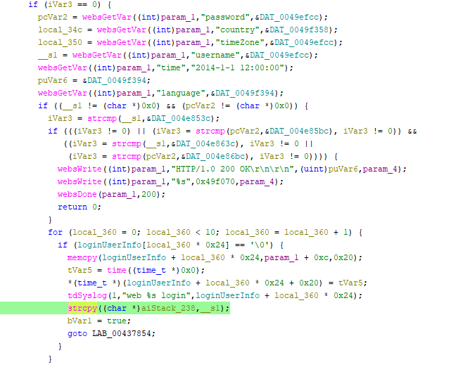

# Tenda W3V1.0BR_V1.0.0.3(2204) Vulnerability (Stack Overflow)
This vulnerability lies in the `R7WebsSecurityHandler` CGI handler which affects the latest firmware of Tenda W3 Wireless Router V1.0.
(The latest version is [V1.0.0.3(2204)](https://www.tenda.com.cn/material/show/2484))

## Vulnerability Description
There is a **stack-based buffer overflow** vulnerability in function `R7WebsSecurityHandler`, which is reachable via
the `R7WebsSecurityHandler` handler registered by `websUrlHandlerDefine("",(char *)0x0,0,(int)R7WebsSecurityHandler,1);` in `FUN_00435e14`(called by function `main`).

In `R7WebsSecurityHandler`, the user-controlled parameters `username` and `password` are retrieved via `websGetVar`,No length validation or sanitization is applied to this input.
- `pcVar2 = websGetVar((int)param_1,"password",&DAT_0049efcc);`
- `__s1 = websGetVar((int)param_1,"username",&DAT_0049efcc);`

After several authentication checks and control-flow branches, the `username` value stored in `__s1` reaches the following statement:
- `strcpy((char *)aiStack_238,__s1);`

Because strcpy performs an unbounded copy until a null terminator is encountered, supplying a sufficiently long username value will overwrite adjacent stack memory.

Reachability:Both parameters are therefore fully controlled by the HTTP request.Execution proceeds only if both parameters are non-null:
- `if ((__s1 != (char *)0x0) && (pcVar2 != (char *)0x0))`

Once the credential check succeeds, execution continues into the session allocation loop:
- `for (local_360 = 0; local_360 < 10; local_360++) && if (loginUserInfo[local_360 * 0x24] == '\0')`

Since the array holds at most ten entries and entries are cleared when sessions expire, a free slot normally exists during typical operation. Consequently, no special constraints are required to satisfy this condition in practice.

## Attack Vector

Send a crafted HTTP request to the `R7WebsSecurityHandler` CGI endpoint with `password != \0` and overly long `username` parameters.

## Impact

- Denial of Service (crash/reboot)
- Potentially arbitrary code execution

## Timeline

- 2026-3-15: CVE request submitted to MITRE(7592)
- 2026-6-6: Public disclosure - CVE-2026-36794