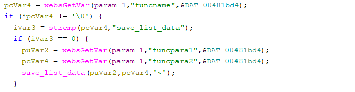

# Tenda W3V1.0BR_V1.0.0.3(2204) Vulnerability (Stack Overflow)
This vulnerability lies in the `formwrlSSIDset` CGI handler which affects the latest firmware of Tenda W3 Wireless Router V1.0.
(The latest version is V1.0.0.3(2204))

## Vulnerability Description

There is a **stack-based buffer overflow** vulnerability in function `formwrlSSIDset`, which is reachable via
the `formwrlSSIDset` handler registered by `websFormDefine("wifiSSIDset",formwrlSSIDset);` in function `formDefineTendDa`.

In `formwrlSSIDset`, the user-controlled parameters `wl_radio` and `index` are retrieved via `websGetVar`:
- `wl_radio = websGetVar(param_1, "wl_radio", "0");`
- `index = websGetVar(param_1, "index", "0");`

The handler then compares `wl_radio` with "0" and enters the `wl_radio == "0"` branch. Inside this branch, regardless of whether `index` equals "0" or not, the code constructs a configuration key prefix using sprintf:
- `sprintf(local_110, "wl2g.ssid%s.", index);`

`index` is fully attacker-controlled and is inserted into the formatted string without any length validation. Since `local_110` is a fixed-size stack buffer, supplying an overly long index value causes `sprintf` to write past the end of `local_110`, resulting in a stack-based buffer overflow.

Control-flow reachability is straightforward:The vulnerable `sprintf` is executed when the request reaches the `formwrlSSIDset` CGI handler (registered via `websFormDefine(...)` in `formDefineTendDa`).

Setting `wl_radio=0` satisfies `strcmp(wl_radio, "0") == 0` and deterministically selects the branch that executes the vulnerable `sprintf`.

The index parameter is consumed directly by `sprintf` in both sub-branches (index == "0" and index != "0"), so no additional constraints are required for reaching the vulnerable call site.

Other parameters retrieved in the same handler (`enableWireless, ssid, broadcastSsid, isolate, maxclients, ssid_encode, etc.`) do not gate the execution of the vulnerable sprintf and are not necessary to reach the overflow condition.
W
## Attack Vector

Send a crafted HTTP request to the `formwrlSSIDset` CGI endpoint with `wl_radio == 0` and overly long `index`
parameters.

## Impact

- Denial of Service (crash/reboot)
- Potentially arbitrary code execution

## Timeline

- 2026-3-4: CVE request submitted to MITRE
