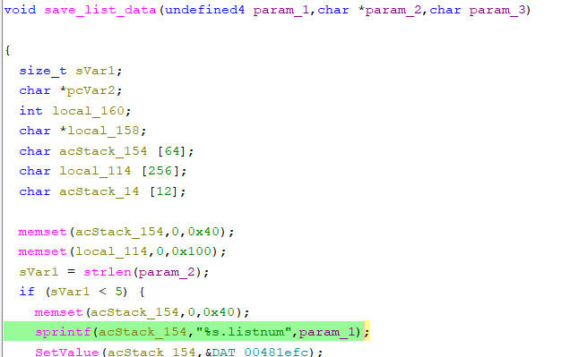

# Tenda W3V1.0BR_V1.0.0.3(2204) Vulnerability (Stack Overflow)
This vulnerability lies in the `formSetCfm` CGI handler which affects the latest firmware of Tenda W3 Wireless Router V1.0.
(The latest version is [V1.0.0.3(2204)](https://www.tenda.com.cn/material/show/2484))

## Vulnerability Description

There is a **stack-based buffer overflow** vulnerability in function `formSetCfm`, which is reachable via
the `formSetCfm` handler registered by `websFormDefine((int *)"setcfm",(int)formSetCfm);` in function `formDefineTendDa`.

In `formSetCfm`, the user-controlled parameters `funcpara1` and `funcpara2` are retrieved via `websGetVar`:

- `puVar2 = websGetVar(param_1,"funcpara1",&DAT_00481bd4);`
- `pcVar4 = websGetVar(param_1,"funcpara2",&DAT_00481bd4);`

In this branch, the function calls `save_list_data`. Inside `save_list_data`, the statement 
- `sprintf(acStack_154, "%s.listnum", param_1)` 
uses the tainted parameter `param_1`. Since there is no length check on this parameter before it is passed to sprintf, a `buffer overflow` can occur.

Reachability: As shown in the code above, when the funcname parameter equals `save_list_data`, the program retrieves user-controlled parameters via `websGetVar` and passes them to `save_list_data`. Therefore, an attacker can control the value that eventually reaches the vulnerable `sprintf` call, making the overflow reachable.
- `sprintf(acStack_154,"%s.listnum",param_1)`

Other parameters retrieved in the same handler do not gate the execution of the vulnerable sprintf and are not necessary to reach the overflow condition.

## Attack Vector

Send a crafted HTTP request to the `formSetCfm` CGI endpoint with `funcname == save_list_data` and overly long `funcpara1` parameters.

## Impact

- Denial of Service (crash/reboot)
- Potentially arbitrary code execution

## Timeline

- 2026-3-10: CVE request submitted to MITRE(4237)
