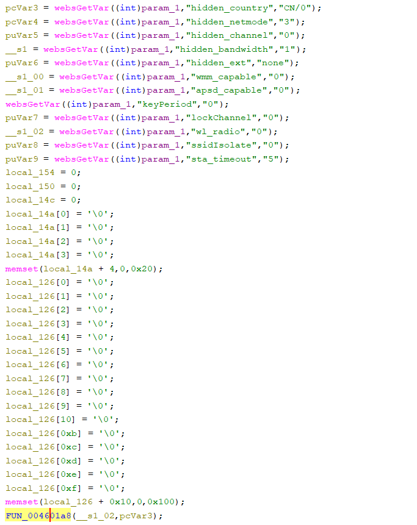
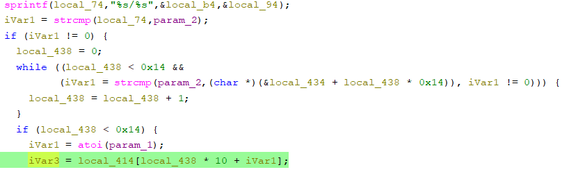

# Tenda W3V1.0BR_V1.0.0.3(2204) Vulnerability (buffer overread)
This vulnerability lies in the `formWifiRadioSet` CGI handler which affects the latest firmware of Tenda W3 Wireless Router V1.0.
(The latest version is [V1.0.0.3(2204)](https://www.tenda.com.cn/material/show/2484))

## Vulnerability Description

There is a **buffer overread** vulnerability in function `formWifiRadioSet`, which is reachable via
the `formWifiRadioSet` handler registered by `websFormDefine((int *)"WifiRadioSet",(int)formWifiRadioSet);` in function `formDefineTendDa`.

In `formWifiRadioSet`, the user-controlled parameters `wl_radio` and `hidden_country` are retrieved via `websGetVar`:
- `__s1_02 = websGetVar((int)param_1,"wl_radio","0");`
- `pcVar3 = websGetVar((int)param_1,"hidden_country","CN/0");`
then calls FUN_004601a8 using `FUN_004601a8(__s1_02,pcVar3)`;

In this function,there is a assignment:
- `iVar1 = atoi(param_1);iVar3 = local_414[local_438 * 10 + iVar1];`

that `param1` is `wl_radio`,we can set a large number to this parameter,then causing **buffer overread** vulnerability.

## Attack Vector

Send a crafted HTTP request to the `formWifiRadioSet` CGI endpoint with `wl_radio == 0x7fffffff`

## Impact

- Denial of Service (crash/reboot)

## Timeline

- 2026-3-15: CVE request submitted to MITRE(7577)
- 2026-6-6: Public disclosure - CVE-2026-36792