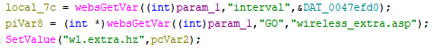
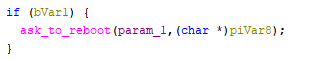
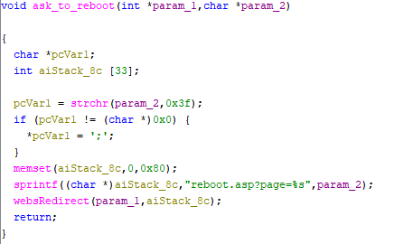

# Tenda ask_to_reboot Vulnerability (Stack Overflow)
This vulnerability lies in the `ask_to_reboot` CGI handler which affects the latest firmware of Tenda US_W3V1.0BR_V1.0.0.3.

## Vulnerability Description

A **stack-based buffer overflow vulnerability** exists in the `ask_to_reboot` function, which is reachable from the wireless configuration handler (function `FUN_00449844`).

In `FUN_00449844`, the user-controlled HTTP parameter `GO` is retrieved via `websGetVar`:

- `GO = websGetVar(wp, "GO", "wireless_extra.asp");`

Later, depending on runtime condition `bVar1`, the handler calls `ask_to_reboot(wp, GO)`

Inside `ask_to_reboot`, the input `param_2` (derived from GO) is processed and then concatenated into a fixed-size stack buffer using unbounded sprintf:

- `sprintf(buf, "reboot.asp?page=%s", param_2);`

Because sprintf performs no bounds checking, an attacker can supply an overly long GO value to overflow the stack buffer, potentially causing a crash/reboot and Denial of Service.

## Attack Vector

A crafted HTTP request to `ask_to_reboot` CGI handler with an excessively long `GO` parameter with `bVar1 != 0` can trigger the vulnerable sprintf path.

## Impact

- Denial of Service (httpd crash / device reboot)

- Potentially arbitrary code execution (depends on architecture and runtime protections: stack canary, NX, ASLR, etc.)

## Timeline

- 2026-3-3: CVE request submitted to MITRE

