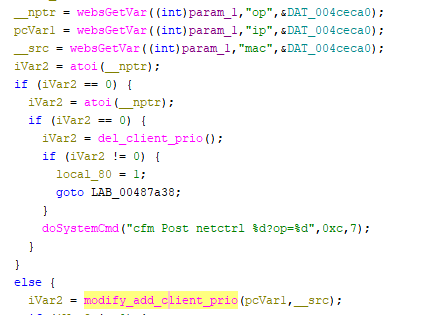
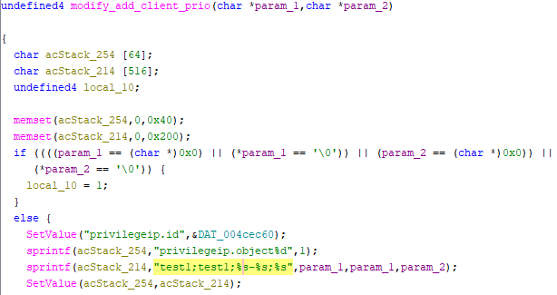

# CVE-2025-69700 Tenda FH1203 Vulnerability
This vulnerability has been assigned CVE-2025-69700.
This vulnerability lies in the `SetClientPrio` CGI handler which affects the latest firmware of Tenda FH1203.
(The latest version is [V2.0.1.6](https://down.tenda.com.cn/uploadfile/FH1203/fh1203_kfw_V2.0.1.6_cn_svn1134.zip))

## Vulnerability Description

There is a **stack-based buffer overflow** vulnerability in function `modify_add_client_prio`, which is reachable via
the `formSetClientPrio` handler registered by `websFormDefine("SetClientPrio", formSetClientPrio)`.

In `formSetClientPrio`, the user-controlled parameters `ip` and `mac` are retrieved via `websGetVar` and passed to
`modify_add_client_prio(ip, mac)` without length validation. Inside `modify_add_client_prio`, `sprintf` concatenates
`ip` (twice) and `mac` into a fixed-size stack buffer `acStack_214[516]` without bounds checking:

- `sprintf(acStack_214, "test1;test1;%s-%s;%s", ip, ip, mac);`

A remote attacker can trigger a stack overflow by supplying overly long `ip` and/or `mac` values.

## Attack Vector

Send a crafted HTTP request to the `SetClientPrio` CGI endpoint with `op != 0` and overly long `ip` and/or `mac`
parameters.

## Impact

- Denial of Service (crash/reboot)
- Potentially arbitrary code execution

## Timeline

- 2025-12-12: CVE request submitted to MITRE
- 2026-01-13: Public disclosure - CVE-2025-69700
